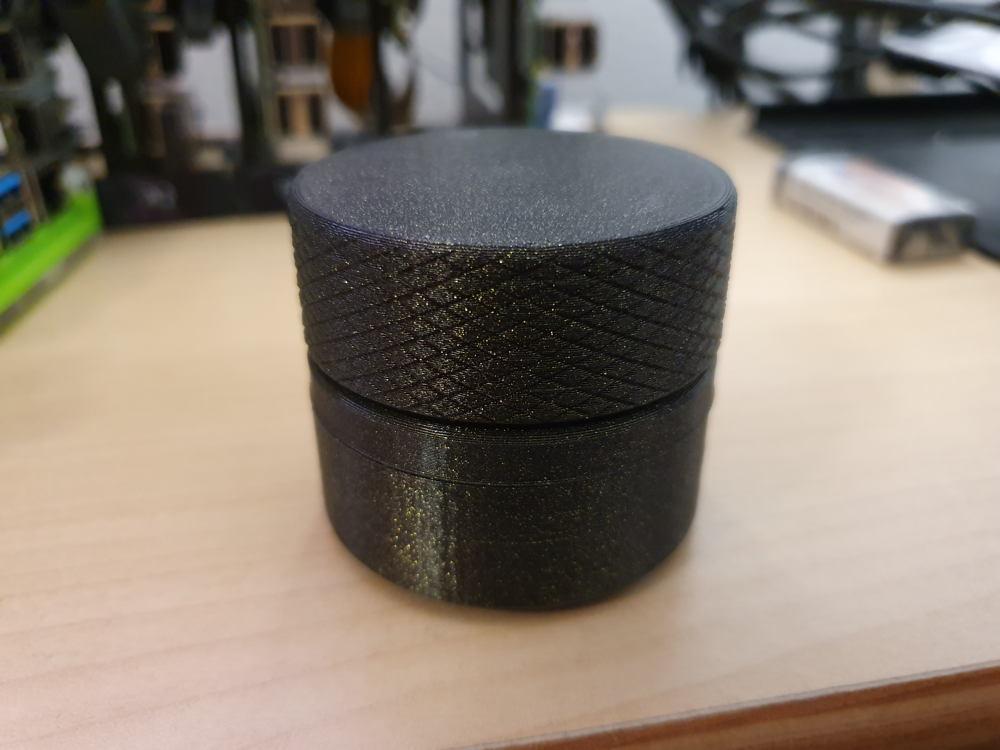

# SonosRemote

Sonos remote control based on an ESP8266, a rotary encoder, MicroPython and [Sonos HTTP API](https://jishi.github.io/node-sonos-http-api/).

## Features

  * Control playback and volume with one knob
    * Volume up/down on cw/ccw rotation of encoder
    * Toggle play/pause on single press
    * Next track on double press
    * Previous track on long press
  * Activity LED on sent commands
  * Configurable via provisioning file
  * Syslog support for info/debug logging
  * Implemented based on asyncio

## BOM/Prerequisits

  * Wemos D1 Mini
  * KY-040 rotary encoder breakout
  * Existing and configured install of [Sonos HTTP API](https://jishi.github.io/node-sonos-http-api/) (e.g. in a Docker container).
  * 3d printed case & knob
  * 2 x M3x10mm screws

## Setup

The firmware files can be find in the `src/` folder.

  * If not already done, install [Sonos HTTP API](https://jishi.github.io/node-sonos-http-api/) somewhere on your network. This is mandatory.
  * Flash current version of MicroPython to the Wemos D1 Mini as described [here](https://docs.micropython.org/en/latest/esp8266/tutorial/intro.html)
  * Create a `sonos_remote_config.py` for your target network, room and pin assignment. An example is provided which assumes the following wiring for the rotary encoder:
    * CLK to D6 aka pin 12
    * DT to D7 aka pin 13
    * SW to D5 aka pin 14
  * Copy `main.py`, `sonos_remote_config.py` and the whole `lib/` folder to the Wemos D1 Mini. You can use `ampy`, `rflash` or similar to do this.
  * Reset the board and test. 

## Case

STLs for printing a case are provided in the `stls/` folder.

Please note:

  * `case_bottom.stl` needs support from the build plate
  * `case_top.stl` needs to be flipped to lie flat, no supports needed

